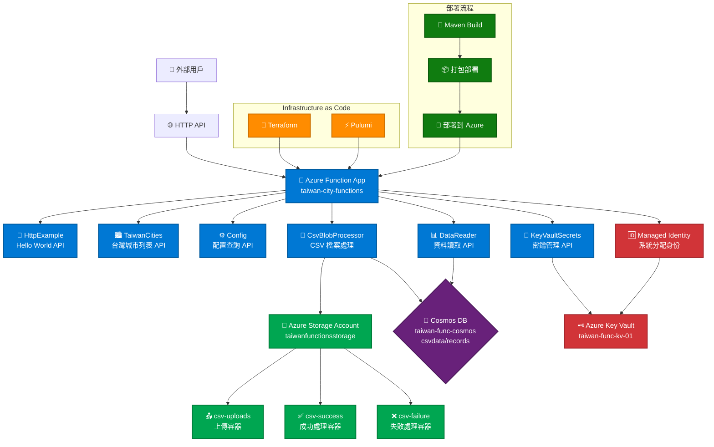

# Azure Functions 專案架構圖

## 系統概覽

這是一個基於 Azure Functions 的無伺服器應用程式，提供台灣城市資料 API 和 CSV 檔案處理功能。系統支援多種部署方式（Terraform 和 Pulumi）並整合了多個 Azure 服務。

## 架構圖



## 詳細架構說明

### 1. 核心組件

#### Azure Function App
- **名稱**: `taiwan-city-functions`
- **運行時**: Java 17
- **計劃類型**: Consumption (Y1)
- **位置**: East Asia

#### HTTP 觸發函數
1. **HttpExample** - 簡單的 Hello World API
2. **TaiwanCities** - 返回台灣城市列表的 JSON API
3. **Config** - 顯示當前環境變數和配置設定
4. **KeyVaultSecrets** - 從 Key Vault 讀取密鑰
5. **DataReader** - 從 Cosmos DB 讀取資料

#### Blob 觸發函數
- **CsvBlobProcessor** - 處理上傳到 `csv-uploads` 容器的 CSV 檔案

### 2. 儲存服務

#### Azure Storage Account
- **名稱**: `taiwanfunctionsstorage`
- **類型**: Standard LRS
- **用途**: Function App 運行時儲存和 CSV 檔案處理

#### Blob 容器
- **csv-uploads** - 接收上傳的 CSV 檔案
- **csv-success** - 成功處理的檔案
- **csv-failure** - 處理失敗的檔案

### 3. 資料庫服務

#### Cosmos DB (可選)
- **帳戶名稱**: `taiwan-func-cosmos`
- **資料庫**: `csvdata`
- **集合**: `records`
- **用途**: 儲存 CSV 處理後的資料

### 4. 安全服務

#### Azure Key Vault (可選)
- **名稱**: `taiwan-func-kv-01`
- **用途**: 儲存 API 金鑰和資料庫連接字串
- **整合**: 透過 Managed Identity 存取

### 5. 基礎設施管理

#### Terraform 模組
```
modules/
├── resource_group/      # 資源組管理
├── storage_account/     # 儲存帳戶
├── function_app/        # Function App
├── cosmos_db/          # Cosmos DB (可選)
└── key_vault/          # Key Vault (可選)
```

#### Pulumi 支援
- 提供相同的基礎設施部署能力
- 使用 TypeScript/JavaScript 編寫

### 6. 部署流程

1. **基礎設施部署**
   ```bash
   terraform init
   terraform apply
   ```

2. **應用程式部署**
   ```bash
   mvn clean package
   ./deploy-app.sh
   ```

### 7. 環境變數

| 變數名稱 | 描述 | 預設值 |
|---------|------|--------|
| `APP_ENVIRONMENT` | 應用程式環境 | development |
| `API_VERSION` | API 版本 | v1 |
| `DEBUG_MODE` | 除錯模式 | true |
| `MAX_CITIES_COUNT` | 最大城市數量 | 50 |
| `KEY_VAULT_ENABLED` | 啟用 Key Vault | false |
| `COSMOS_DB_ENABLED` | 啟用 Cosmos DB | false |

### 8. API 端點

| 端點 | 方法 | 描述 |
|------|------|------|
| `/api/HttpExample` | GET/POST | Hello World API |
| `/api/cities` | GET | 台灣城市列表 |
| `/api/config` | GET | 配置查詢 |
| `/api/secrets` | GET | Key Vault 密鑰 |
| `/api/data` | GET | Cosmos DB 資料 |

### 9. 資料流程

1. **CSV 處理流程**:
   ```
   上傳 CSV → csv-uploads → CsvBlobProcessor → 驗證/處理 → 
   Cosmos DB 儲存 → 移動到 csv-success/csv-failure
   ```

2. **API 請求流程**:
   ```
   用戶請求 → Azure Functions → 處理邏輯 → 回應
   ```

3. **密鑰管理流程**:
   ```
   Function App → Managed Identity → Key Vault → 密鑰存取
   ```

## 擴展性考量

- **水平擴展**: Azure Functions 自動擴展
- **垂直擴展**: 可升級到 Premium 計劃
- **多區域**: 可部署到多個 Azure 區域
- **監控**: 整合 Azure Monitor 和 Application Insights
- **安全性**: 支援 VNet 整合和私有端點 