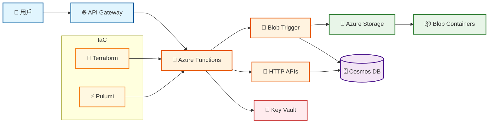

# Azure Functions 簡化架構圖

## 核心架構



## 組件說明

### 🚀 Azure Functions
- **HttpExample**: Hello World API
- **TaiwanCities**: 台灣城市列表 API  
- **Config**: 配置查詢 API
- **CsvBlobProcessor**: CSV 檔案處理器

### 💾 Azure Storage
- **csv-uploads**: 接收上傳檔案
- **csv-success**: 成功處理檔案
- **csv-failure**: 失敗處理檔案

### 🗄️ Cosmos DB (可選)
- 儲存 CSV 處理後的資料
- 支援結構化查詢

### 🔐 Key Vault (可選)
- 安全儲存密鑰和連接字串
- 透過 Managed Identity 存取

### 🔧 Infrastructure as Code
- **Terraform**: 使用 HCL 語法
- **Pulumi**: 使用 TypeScript/JavaScript

## 資料流程

```
1. 用戶請求 → Azure Functions → 回應
2. CSV 上傳 → Blob Storage → 觸發處理 → Cosmos DB
3. 密鑰存取 → Managed Identity → Key Vault
``` 