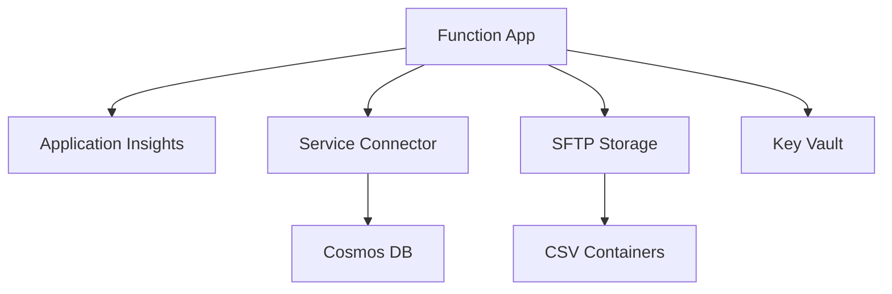

# Azure Functions Pulumi Infrastructure

This directory contains the Pulumi TypeScript implementation for the Azure Functions project, now updated with Service Connector and enhanced monitoring capabilities.

## ✨ New Features

This implementation now includes all the advanced features from the Terraform version:

### 🔐 Service Connector with Managed Identity
- **Zero-Secret Connection**: Uses System-assigned Managed Identity to connect to Cosmos DB
- **Automatic Configuration**: Service Connector automatically sets environment variables
- **Enhanced Security**: No connection string secrets stored in configuration

### 📊 Application Insights Integration
- **Comprehensive Monitoring**: 90-day retention, 100% sampling rate
- **Automatic Configuration**: Connection string automatically injected
- **Rich Telemetry**: Function execution logs, performance metrics, and custom events

### 📁 SFTP Storage Account
- **Separate Storage**: Dedicated SFTP-enabled storage for CSV processing
- **Hierarchical Namespace**: Supports SFTP protocol for file uploads
- **Blob Triggers**: Automatic processing of uploaded CSV files

## 📋 Architecture Overview



## 🚀 Quick Start

### 1. Prerequisites
```bash
# Install Pulumi CLI
curl -fsSL https://get.pulumi.com | sh

# Install Node.js dependencies
npm install

# Login to Azure
az login
```

### 2. Configuration
```bash
# Copy example configuration
cp Pulumi.dev.yaml.example Pulumi.dev.yaml

# Edit configuration values
# Update resource names, locations, and feature flags
```

### 3. Deploy Infrastructure
```bash
# Initialize Pulumi stack
pulumi stack init dev

# Preview changes
pulumi preview

# Deploy infrastructure
pulumi up

# Deploy application
./deploy-app.sh
```

## ⚙️ Configuration Options

### Core Settings
```yaml
azure-functions-demo:resourceGroupName: taiwan-functions-rg
azure-functions-demo:functionAppName: taiwan-city-functions
azure-functions-demo:storageAccountName: twfuncstorage01
azure-functions-demo:location: eastasia
```

### Application Insights
```yaml
azure-functions-demo:applicationInsightsName: taiwan-func-insights
```

### Service Connector & Cosmos DB
```yaml
azure-functions-demo:enableCosmosDb: true
azure-functions-demo:cosmosDbAccountName: taiwan-func-cosmos
azure-functions-demo:cosmosDatabaseName: csvdata
azure-functions-demo:cosmosCollectionName: records
```

### Key Vault (Optional)
```yaml
azure-functions-demo:enableKeyVault: true
azure-functions-demo:keyVaultName: taiwan-func-kv-01
```

## 🔍 Monitoring & Logging

### Application Insights
- **Status**: ✅ Enabled (90 days retention)
- **Sampling**: 100%
- **Integration**: Automatic connection string injection

### Function App Logging
- **Application Logs**: Information level
- **HTTP Logs**: Enabled (3 days retention)
- **Always On**: Enabled for blob triggers

### Service Connector
- **Authentication**: System-assigned Managed Identity
- **Environment Variables**: Automatically configured
- **Benefits**: Zero-secret architecture

## 📊 Available Endpoints

After deployment, test these endpoints:

### Core APIs
```bash
# Basic function
curl "https://your-function-app.azurewebsites.net/api/HttpExample?name=Pulumi"

# Taiwan cities
curl "https://your-function-app.azurewebsites.net/api/cities"

# Configuration
curl "https://your-function-app.azurewebsites.net/api/config"

# Key Vault secrets
curl "https://your-function-app.azurewebsites.net/api/secrets"
```

### CSV Data APIs (Cosmos DB enabled)
```bash
# Read all data
curl "https://your-function-app.azurewebsites.net/api/data"

# Query data
curl "https://your-function-app.azurewebsites.net/api/query"
curl "https://your-function-app.azurewebsites.net/api/query?id=001"
curl "https://your-function-app.azurewebsites.net/api/query?fileName=test_data"
```

## 🛠️ Log Access Commands

### Real-time Logs
```bash
az functionapp log tail --name YOUR_FUNCTION_APP --resource-group YOUR_RG
```

### Download Logs
```bash
az webapp log download --name YOUR_FUNCTION_APP --resource-group YOUR_RG --log-file app-logs.zip
```

### Application Insights Queries
```bash
az monitor app-insights query \
  --app YOUR_APPINSIGHTS_NAME \
  --analytics-query "requests | limit 10"
```

## 🔄 CSV Processing Workflow

1. **Upload**: CSV files to SFTP storage `csv-uploads` container
2. **Process**: Blob trigger automatically processes files
3. **Success**: Processed files moved to `csv-success` container
4. **Failure**: Failed files moved to `csv-failure` container with error logs
5. **Query**: Data available via `/api/data` and `/api/query` endpoints

## 📈 Outputs

After deployment, Pulumi provides these outputs:

```bash
# View all outputs
pulumi stack output

# Key outputs
pulumi stack output functionAppUrl
pulumi stack output applicationInsightsName
pulumi stack output cosmosAccountName
pulumi stack output serviceConnectorName
```

## 🆚 Pulumi vs Terraform

This Pulumi implementation now has **feature parity** with the Terraform version:

| Feature | Pulumi ✅ | Terraform ✅ |
|---------|-----------|-------------|
| Service Connector + Managed Identity | ✅ | ✅ |
| Application Insights | ✅ | ✅ |
| SFTP Storage Account | ✅ | ✅ |
| Enhanced Logging | ✅ | ✅ |
| Complete Documentation | ✅ | ✅ |

## 🧹 Cleanup

```bash
# Destroy all resources
pulumi destroy

# Remove stack
pulumi stack rm dev
```

## 🔗 Related Documentation

- [Terraform Implementation](../terraform/README.md) - Alternative IaC approach
- [Application Source](../../applications/taiwan-city-functions/) - Java Function App code
- [Main Project README](../../../README.md) - Project overview